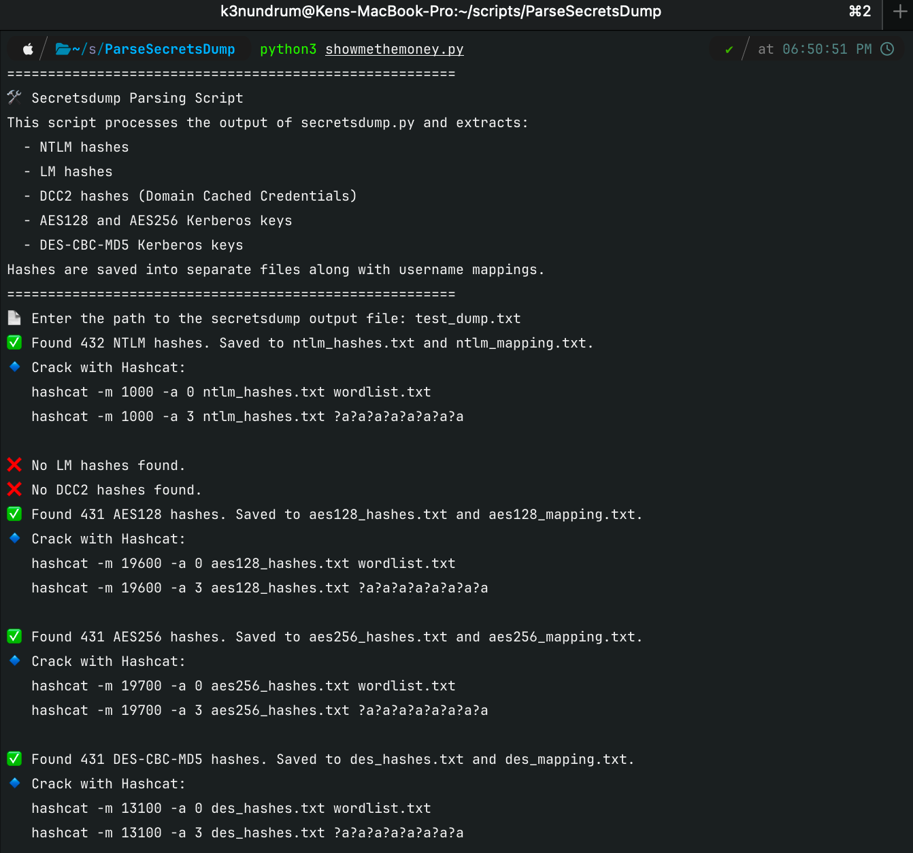
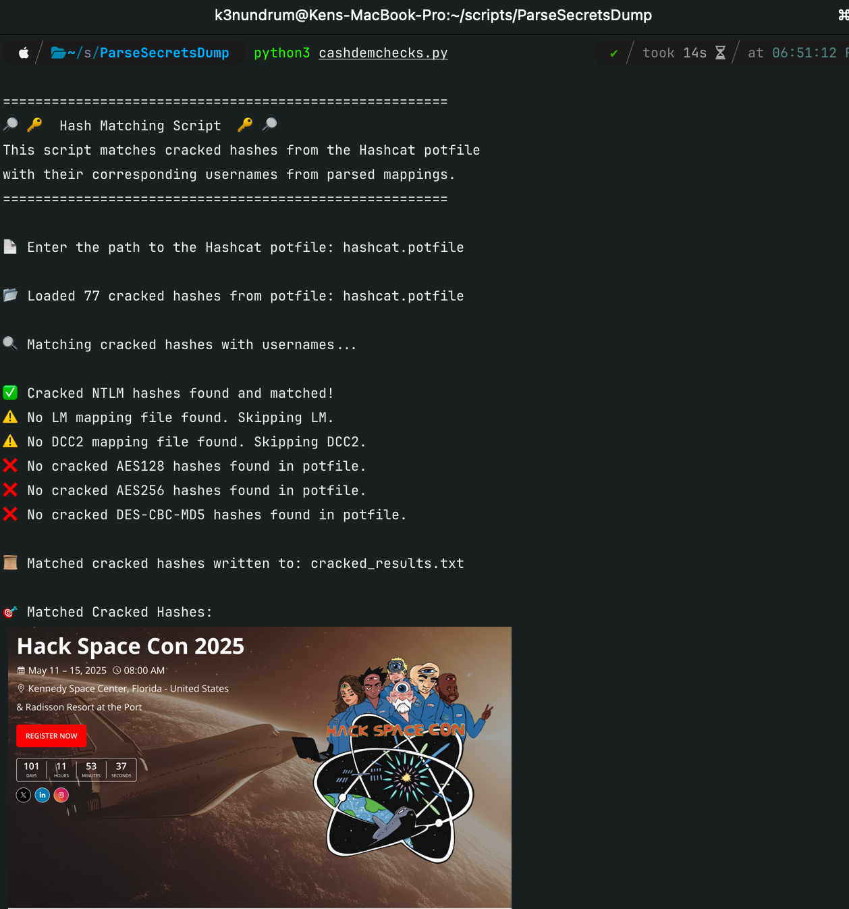

# SeerCrack 

---

🚀 SeerCrack is an NTDS & Secretsdump Hash Extraction & Cracking Automation toolset for automating the extraction, cracking, and correlation of Windows authentication hashes from Active Directory domain controllers (NTDS.dit) and live Windows hosts using secretsdump.py.

This toolkit helps pentesters, security researchers, and blue teams by:

✔️ Extracting NTLM, LM, DCC2 (cached credentials), AES128, AES256, and DES hashes  
✔️ Generating ready-to-use Hashcat commands for password cracking  
✔️ Automatically matching cracked hashes to usernames for easy analysis  
✔️ Supporting both offline NTDS dumps and live Windows extractions  
✔️ Providing real-time output & structured reports

## 📌 Features  
✅ Supports both NTDS.dit and standard host dumps.  
✅ Extracts NTLM, LM, DCC2 (cached credentials), AES128, AES256, and DES hashes.  
✅ Provides copy-paste Hashcat commands for easy cracking.  
✅ Matches cracked passwords to usernames for easy analysis.  
✅ Real-time terminal output while also saving results to a file.  
✅ Handles missing files gracefully and ensures results are always written.  


# 1️⃣ **Extract Hashes Using Secretsdump**  
*Use Case 1: Extracting Hashes from NTDS.dit (Domain Controller Dump)*
```bash
impacket-secretsdump -system SYSTEM -ntds ntds.dit LOCAL > secretsdump_output.txt
```

*Use Case 2: Extracting Hashes from a Live Host*
```bash
impacket-secretsdump -target-ip <IP> administrator@victim.local
```
*Use Case 3: Yours*

# 2️⃣ **Parse & Organize Extracted Hashes.**

Run `seer_extract.py` to extract and organize different hash types.  
What Happens?  
- Extracts NTLM, LM, and DCC2 hashes.
- Saves them into separate files.
- Prints ready-to-use Hashcat commands.

🔹 Example Output:



# **3️⃣ Crack Hashes with Hashcat**.   
Use the commands printed in the previous step to crack the hashes.

*NTLM Cracking Example:*
```bash
hashcat -m 1000 -a 0 ntlm_hashes.txt wordlist.txt
```
*DCC2 (Cached Credentials) Cracking Example*
```bash
hashcat -m 2100 -a 0 dcc_hashes.txt wordlist.txt
```
🔹 Example Cracked Output:
```shell
5f4dcc3b5aa765d61d8327deb882cf99:password
```

# **4️⃣ Match Cracked Hashes to Usernames**.  
Once hashes are cracked, map them back to usernames using `seer_match.py` and the `hashcat.potfile`:

🔹 Example Output:

📌 All matched credentials are saved in cracked_results.txt and displayed in console.


## 📖 File Outputs
| **File**               | **Purpose**  |
|------------------------|-------------|
| `ntlm_hashes.txt`      | NTLM hashes for cracking (Hashcat mode **1000**) |
| `lm_hashes.txt`        | LM hashes for cracking (Hashcat mode **3000**) |
| `dcc_hashes.txt`       | Cached credentials (DCC2) for cracking (Hashcat mode **2100**) |
| `aes128_hashes.txt`    | AES128 Kerberos keys (Hashcat mode **19600**) |
| `aes256_hashes.txt`    | AES256 Kerberos keys (Hashcat mode **19700**) |
| `des_hashes.txt`       | DES-CBC-MD5 Kerberos keys (Hashcat mode **13100**) |
| `cracked_results.txt`  | Final matched usernames + cracked passwords |
---

### 🙌 Credits & Contributions
Inspired by Impacket, Hashcat, DPAT, and Active Directory security research.

Open to pull requests and improvements! Feel free to contribute.

🔥 Star this repo, fork it, and start cracking! 🔥

